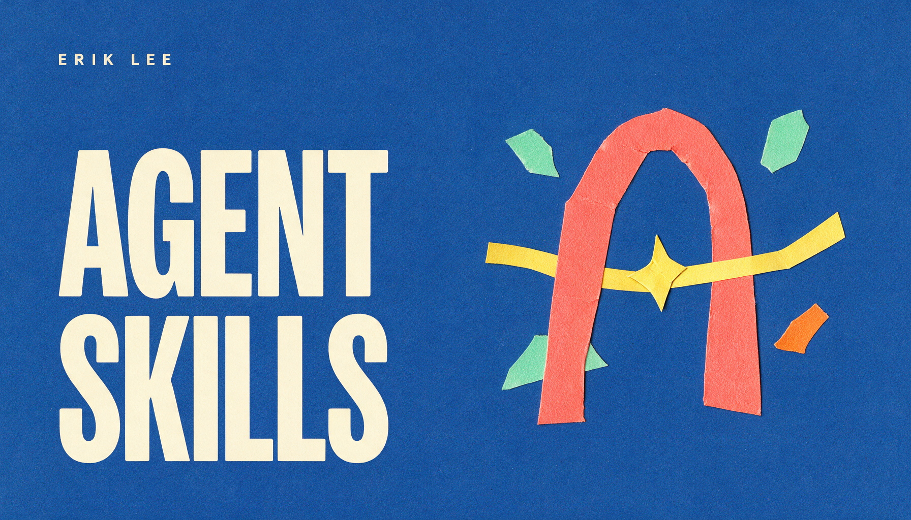

# erik-agent-skills

Erik's personal Agent Skills repository.

## Repository role

- `skills/` is the canonical source and publishing directory.
- Writing skills are developed first in `writing-agent-harness`.
- Mature skills are promoted here for cross-project and cross-agent reuse.

Each skill is a self-contained directory with a `SKILL.md` file and optional
`scripts/`, `references/`, and `assets/`.

## Status

The first seed set of 23 writing skills has been promoted from
`writing-agent-harness`.
